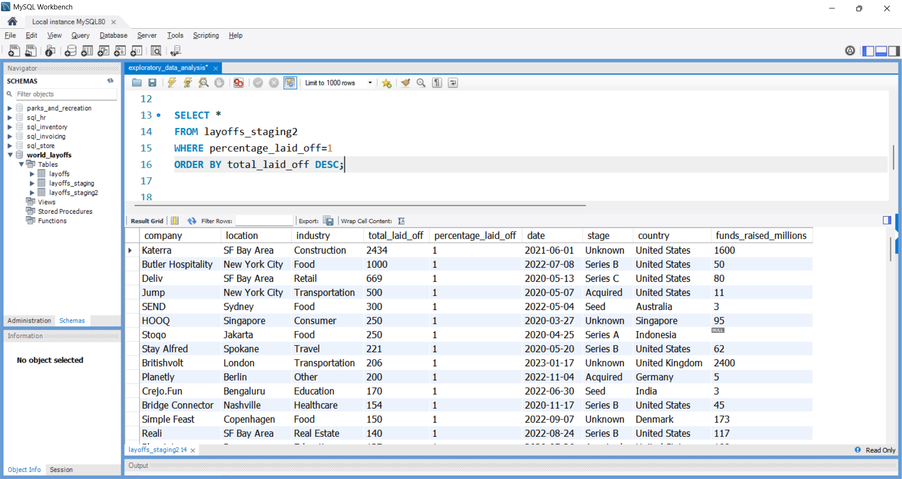
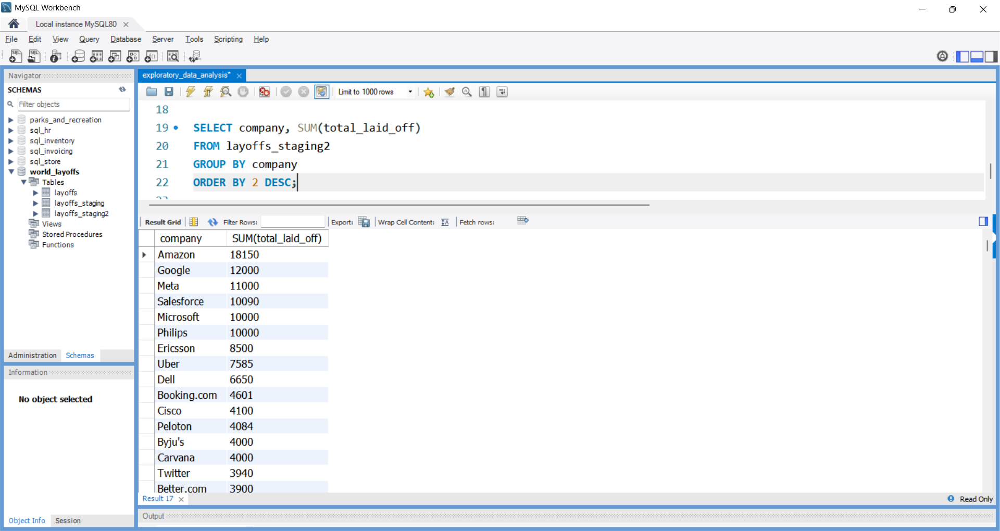
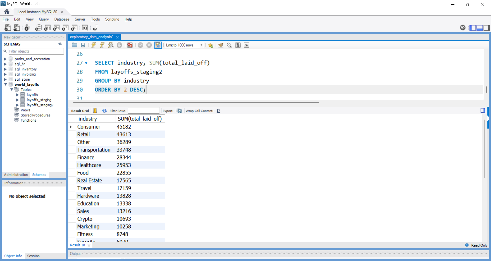
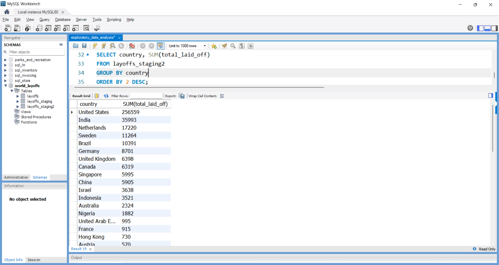
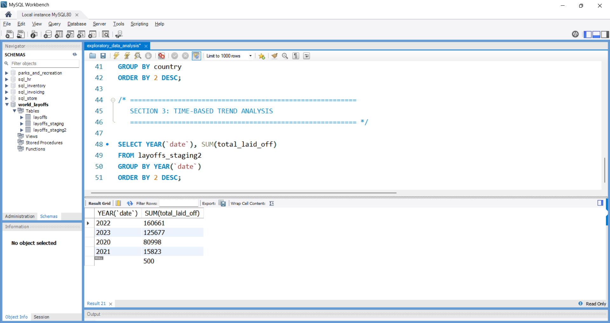
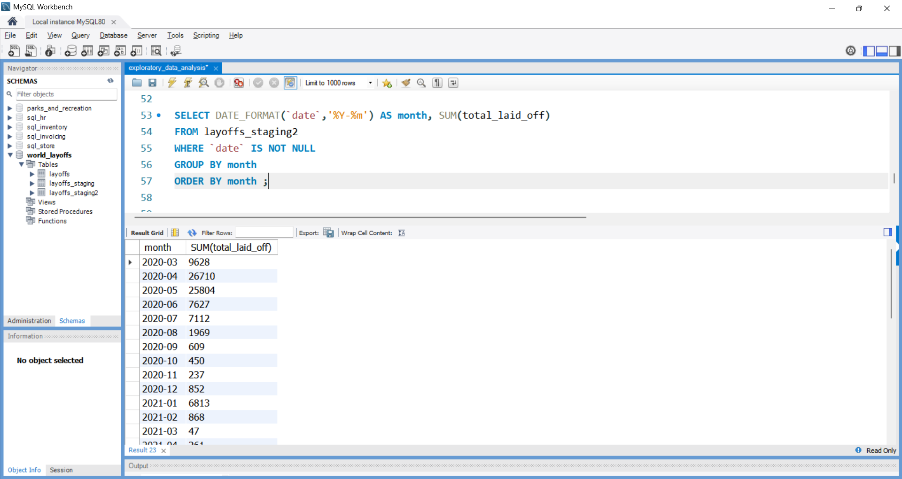
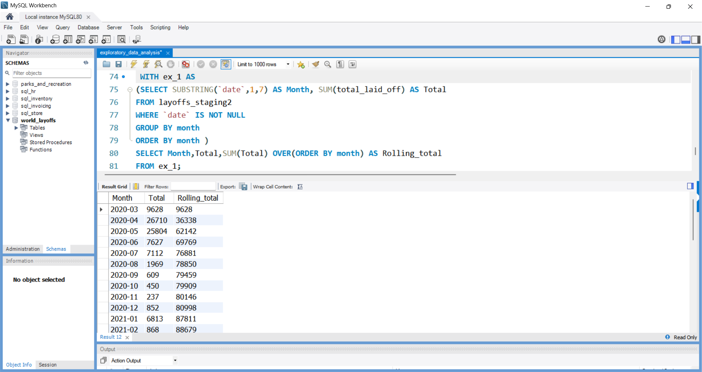
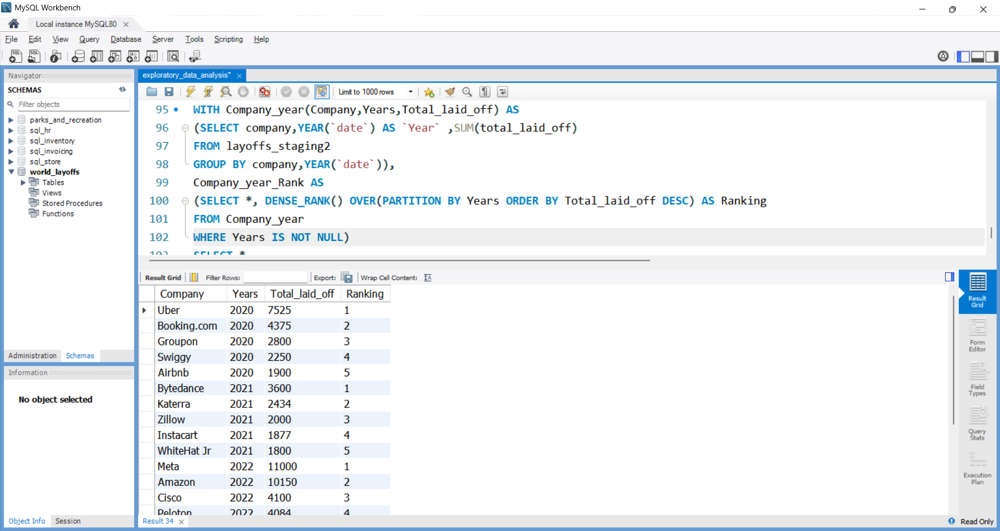

# SQL Exploratory Data Analysis - World Layoffs Dataset

## Project Overview

This project focuses on Exploratory Data Analysis (EDA) of the World Layoffs dataset using MySQL.

The objective of this project was to analyze layoff trends across companies, industries, countries, and time periods to uncover meaningful insights from the data.

The dataset used in this project was cleaned and prepared in a previous SQL Data Cleaning project before conducting the analysis.

---

## Related Project

This analysis was performed on the cleaned dataset generated in the following project:

### SQL Data Cleaning Project

https://github.com/Abdul-Wasey-M/sql-data-cleaning-layoffs

---

## Tools Used

- MySQL
- MySQL Workbench
- Git
- GitHub
- Visual Studio Code

---

## Analysis Performed

### 1. Initial Exploratory Analysis

- Identified the maximum number of layoffs recorded.
- Examined companies with 100% workforce layoffs.
- Investigated funding raised by companies that completely shut down.

### 2. Company Analysis

- Calculated total layoffs by company.
- Identified companies with the highest layoffs.

### 3. Industry Analysis

- Analyzed layoffs across industries.
- Determined the most affected sectors.

### 4. Country Analysis

- Calculated total layoffs by country.
- Examined the geographic impact of layoffs.

### 5. Time-Based Trend Analysis

- Analyzed layoffs by year.
- Analyzed layoffs by month.
- Identified periods with significant increases in layoffs.

### 6. Rolling Total Analysis

- Calculated cumulative layoffs over time using window functions.
- Observed the progression of layoffs across different periods.

### 7. Company Ranking Analysis

- Ranked companies by total layoffs for each year.
- Used DENSE_RANK() to identify top affected companies annually.

---

## SQL Concepts Used

- Aggregate Functions
- GROUP BY
- ORDER BY
- Common Table Expressions (CTEs)
- Window Functions
- DENSE_RANK()
- Date Functions
- Subqueries
- Filtering and Sorting
- Data Aggregation

---

## Project Screenshots

### Companies with 100% Layoffs



### Company Analysis



### Industry Analysis



### Country Analysis



### Yearly Trends



### Monthly Trends



### Rolling Total Analysis



### Company Rankings



---

## Key Insights

- Several companies experienced complete workforce layoffs, resulting in 100% employee reductions.
- The technology industry was among the most affected sectors.
- Layoffs increased significantly during periods of economic uncertainty.
- The United States recorded the highest total number of layoffs among all countries.
- Certain companies consistently ranked among the highest in layoffs across multiple years.
- Time-based analysis revealed clear trends and spikes in workforce reductions.
- Rolling total analysis highlighted the cumulative impact of layoffs over time.

---

## Repository Structure

```text
sql-eda-layoffs/
│
├── dataset/
│   └── layoffs_cleaned.csv
│
├── screenshots/
│   ├── 01_companies_with_100_percent_layoffs.png
│   ├── 02_company_analysis.png
│   ├── 03_industry_analysis.png
│   ├── 04_country_analysis.png
│   ├── 05_yearly_trends.png
│   ├── 06_monthly_trends.png
│   ├── 07_rolling_total_analysis.png
│   └── 08_company_rankings.png
│
├── sql_scripts/
│   └── exploratory_data_analysis.sql
│
└── README.md
```

---

## Author

**Mohammed Abdul Wasey**

Aspiring Data Analyst | Machine Learning Enthusiast | SQL & Data Analytics Learner
